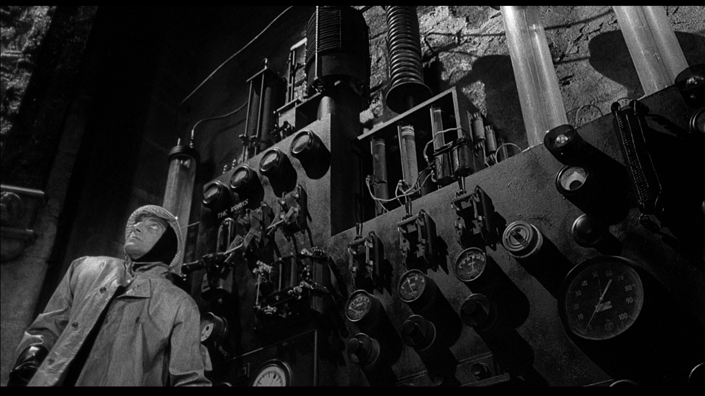
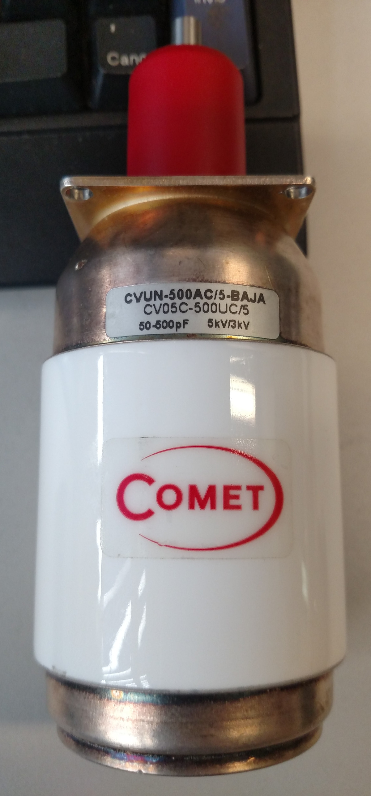
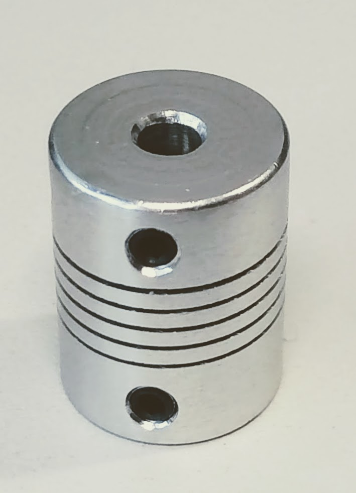

## Yet Another Magnetic Loop
### February-March 2018

I grow up in a small town, where a fishing rod out of the window and the complicity of super-strong japan-made samurai finals, were more than enough to enjoy the radio amateur hobby.

Since I moved to Rome I realized that the monster-sized towns are the cradle of every kind of interfering signals.  The initial frustration has trasformed soon into a challeninging interest into [RFI](https://en.wikipedia.org/wiki/Electromagnetic_interference) and how to survive to them.

The solution I've found is to build an antenna system which is small enough for an apartment balcony and very selective.

The obvious solution is to put toghether the ideas for this Yet Another Magnetic Loop, which is nothin new but a synthesis of what I've found around.

### Dimensioning 

Using the AA5TB Small Magnetic Loop Antenna Calculator version 1.22a, the diameter of the loop will be 1.34 meters.

#### Diameter of the conductor
The diameter of the conductor will influence the efficiency and the bandwidth.

__Copper pipes__ local hardware stores have copper diameters of diameters ranging from 12mm to 22mm.
__Coaxial cables__  Low loss cables for WiFi have external diameters in the range 2.5-22.9mm.
__Polyethylene pressure pipes __  PN6 (6bar) have diameters reaching 32mm.

### Materials

The loop antenna is basically a big RLC circuit, where L and C are respectively the loop and the capacitor.

__Loop conductor__ Current runs on the surface of the conductor.  A 3/4 inch or 2 cm copper pipe represents a good compromise.  The bigger the conductor the lower is the resistance, and the larger the bandwidth. 

__Variable Capacitor__ For 100W we should expect at least 4000V between the plates of the capacitor.  On a variable air capacitor, it takes just 1mm for 3300V to generate and arc.

So in order to use almost all the watts onboard common HF transceivers, I've chosen get a used 5 to 500 pF vacuum capacitor, which can support up to 5000V.

Comet brand seem serious enought to keep an up-to-date archive of specs, so here we have the [datasheet of the Comet CVUN-500AC-5-BAJA](docs/CVUN-500AC-5-BAJA.pdf) .

#### Stepper Motor

Mechanical joint with holes of 8mm and 6mm.

#### List of materials

- [ ] Capacitor
- [ ] Radiator
- [ ] Tuning system

## References

1. [OH8STN](https://oh8stn.org/)
2. [portable magnetic loop ](https://oh8stn.org/blog/2017/02/09/diy-man-portable-magnetic-loop-antenna/)
3. [Ray Montagne (W7CIA) magnetic loop](http://www.ciarc.org/projects/magneticloop.shtml)

