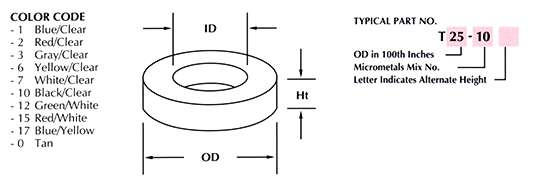

## Superlight QRP Vertical Antenna

Project published on [Thingverse](https://www.thingiverse.com/thing:2808309) as a mod of the original Joe Everhart, [N2CX vertical antenna](http://qrpguys.com/qrpguys-tri-band-portable-vertical-antenna).

# Material

## Toroids

We need two toroids, herein the color and dimension coding

[ ] Amidon T68-2
[ ] Fairite / Amidon FT50-43
[ ] SPDT Switch On-Off-On, e.g. [MIYAMA 167](https://docs.rs-online.com/95d1/0900766b81223ac2.pdf)
[ ] Two pieces of 0.5 mm magnet wire, 100 cm and ca. 55 cm
[ ] 20m antenna wire (DEF 61-12 Pt 6 -- 1.2mm diam 0.22mm² - 24awg 7/0.2mm conductor stranding)
[ ] polyester rope At 2.4mm (0.1 inches) - breaking of 45kg (100 lbs)

 * insert the wire in the toroid and measure one turn with a pen, multiply by 9 three times and add 5 cm for the connections.
 
