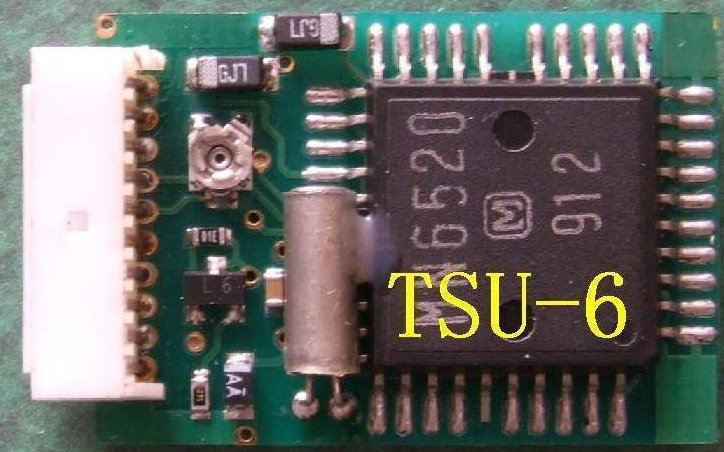
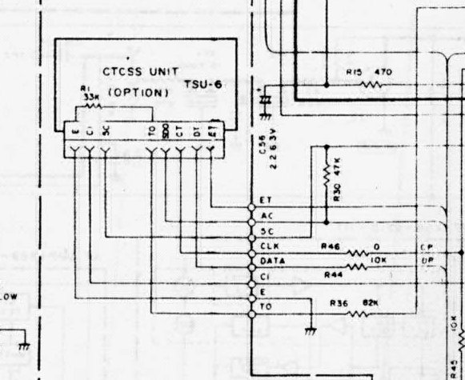

# Enabling CTCSS on TM721E

W7    | TSU-6  | Notes
------|--------|-------
8:ET  | 10:ET  |
 7:DT |  9:DP  | Data
 6:CT |  8:CP  | Clock
 5:SDO|  7:SDO | Serial data out
 4:E  |  6:TO  | TX Out
3:5C  |  3:5C  |
2:CI  |  2:CI  |
1:E   |  1:E   | Ground
 /    |  4:CO  |
 /    |  5: PTT|

SC(K): The clock pulses that the master can use to enable/disable devices.

In models with the CTCSS cable (A-models), there is a 33k resistor between E (GND) and TO when the CTCSS unit is not inserted.  When the unit is installed, then TO in the CTCSS unit goes to VR1 which is a 33k-ohm variable resistor.

 

Pitch is the distance between pins.  
Common one or two rows pin headers are .1" (2.54mm)

http://tech.mattmillman.com/info/crimpconnectors/
